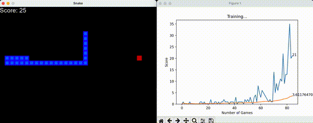
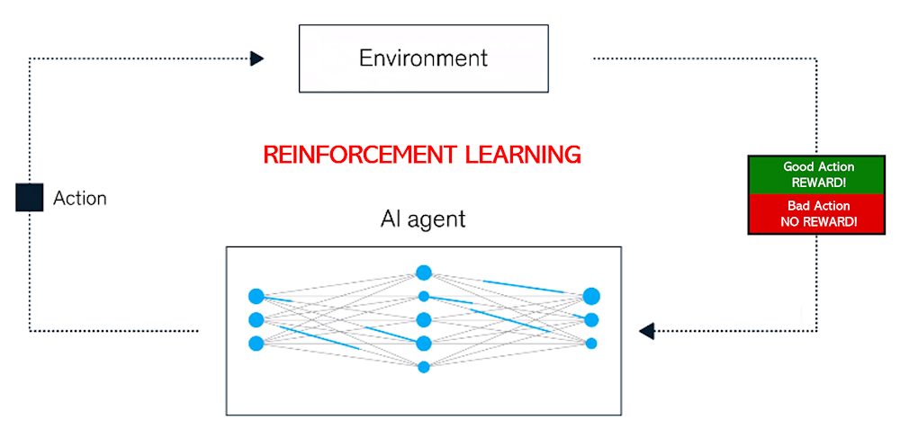
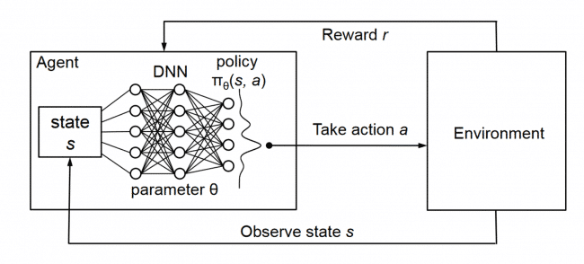
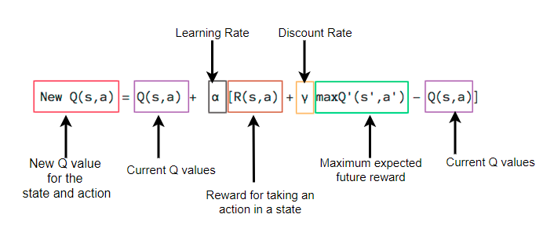
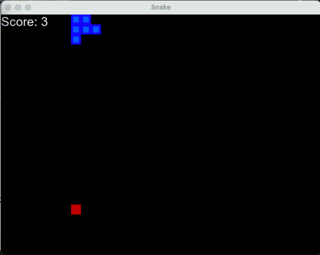

# Reinforcement-Learning-- AI-Play-Snake

## Overview



This repository contains the code for training a reinforcement learning agent to play the classic Snake game using Pygame.

**Reinforcement Learning (RL)** is a type of machine learning where an agent learns how to behave in an environment by performing actions and receiving rewards. The goal is for the agent to learn the optimal sequence of actions to maximize its cumulative reward over time.



**Deep Q-Learning (DQN)** is an extension of Q-learning that leverages deep neural networks to approximate the Q-function. The Q-function represents the expected future rewards for taking a particular action in a given state. Deep Q-Learning allows the agent to handle complex state spaces by learning a function that maps states to Q-values.



**The Bellman equation** is a fundamental concept in reinforcement learning. It expresses the relationship between the value of a state and the values of its successor states. The Q-value, representing the expected future reward of taking action a in state s and following the optimal policy thereafter, is defined by the Bellman equation.



## Additional Resources for RL:
[MIT 6.S191](https://www.youtube.com/watch?v=AhyznRSDjw8)

## Results:

Currently, I have achieved a maximum score of 62 points across 125 games. It appears that the snake occasionally becomes trapped in an endless loop sequence; addressing and enhancing this behavior is a focus for future improvements.



### Environment

```BASH
pyenv local 3.11.3
python -m venv .venv
source .venv/bin/activate
pip install --upgrade pip
pip install -r requirements.txt